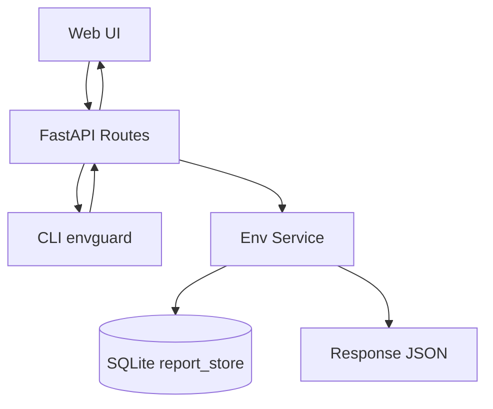
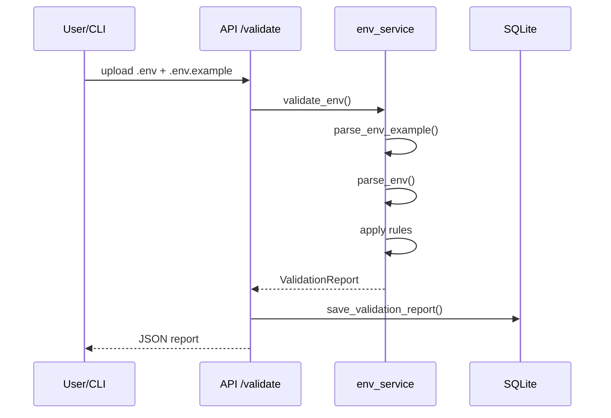

# Env Guard Architecture & Operation

> Tài liệu này mô tả cách Env Guard hoạt động (API, Web UI, CLI, lưu trữ), luồng xử lý, và cách mở rộng.

## 1) Tổng quan

Env Guard là một **dịch vụ FastAPI** giúp:
- Kiểm tra `.env` so với `.env.example` (missing/empty/extra)
- Xác thực giá trị theo rule (type, allowed, regex, min/max, min_len/max_len, aliases, message)
- Diff 2 file `.env` để phát hiện drift
- Sinh bảng docs cấu hình từ `.env.example`
- Lưu lịch sử report vào SQLite
- Cung cấp Web UI và CLI

## 2) Thành phần chính

- **FastAPI app** (`src/app/main.py`): cấu hình router API + Web UI
- **API routes** (`src/app/api/v1/routes/env.py`): validate, diff, docs, history
- **Web UI** (`src/app/web/...`): home, docs page, detail page
- **Business logic** (`src/app/services/env_service.py`): parse/validate/diff/generate docs
- **Storage** (`src/app/db/report_store.py`): SQLite lưu report
- **CLI** (`src/envguard/cli.py`): validate/diff/docs từ terminal

## 3) Luồng hoạt động chính

### 3.1 Validate
- Input: `.env.example` + `.env`
- Output: report gồm các nhóm lỗi: missing/empty/invalid/extra
- Lưu report vào SQLite

### 3.2 Diff
- Input: `base .env` + `compare .env`
- Output: missing_in_compare, extra_in_compare, different_values
- Lưu diff report vào SQLite

### 3.3 Generate Docs
- Input: `.env.example`
- Output: markdown table + list specs

### 3.4 History
- Lưu report vào SQLite (`data/env_guard.db`)
- API và Web UI đọc lại theo id, tải JSON

## 4) Cách parse rule trong `.env.example`

Rule được viết ở **comment line** phía trên biến env, tách bằng `|`:

```
# Logging level | allowed=debug,info,warning,error | allowed_ci=true | aliases=warn,err
LOG_LEVEL=info
# Server port | type=int | min=1024 | max=65535
PORT=8000
# Required secret token | pattern=^[A-Za-z0-9_\-]{12,}$ | min_len=12 | message=Token must be 12+ safe chars
SECRET_TOKEN=
```

### Rule hỗ trợ
- `type`: `int`, `float`, `bool`
- `allowed`: danh sách giá trị
- `allowed_ci`: so sánh không phân biệt hoa thường
- `pattern`: regex
- `min` / `max`: numeric range
- `min_len` / `max_len`: độ dài string
- `aliases`: alias bổ sung cho enum
- `message`: thông điệp lỗi tùy chỉnh (hỗ trợ `{code}` và `{value}`)

## 5) Mermaid Diagram

### 5.1 Overall Flow



### 5.2 Validate Flow



## 6) API Endpoints (tóm tắt)

- `POST /api/v1/env/validate`
- `GET /api/v1/env/report`
- `POST /api/v1/env/diff`
- `GET /api/v1/env/diff/report`
- `POST /api/v1/env/docs`
- `GET /api/v1/env/history`
- `GET /api/v1/env/history/{id}`
- `GET /api/v1/env/diff/history`
- `GET /api/v1/env/diff/history/{id}`

## 7) Web UI

- `/` Home: validate + diff
- `/docs` Docs: generate table
- `/history/{id}` và `/diff-history/{id}`: detail + download JSON

## 8) CLI

Ví dụ:

```
envguard validate --example .env.example --env .env --format summary
envguard diff --base .env --compare .env.staging --pretty
envguard docs --example .env.example --out docs/config.md
```

Exit code:
- `0` = ok
- `1` = nếu dùng `--fail-on-warning`
- `2` = có lỗi nhưng không bật fail-on-warning

## 9) Storage

- DB mặc định: `data/env_guard.db`
- Override path: `ENV_GUARD_DB=/path/to/db`

## 10) Mở rộng

- Thêm rule mới: chỉnh `env_service.py` (parse + validate)
- Thêm UI tab: tạo template + route mới
- Thêm storage: thay `report_store.py` bằng backend khác

---

Nếu bạn muốn, mình có thể thêm sơ đồ cho phần Web UI hoặc CLI cụ thể hơn.
